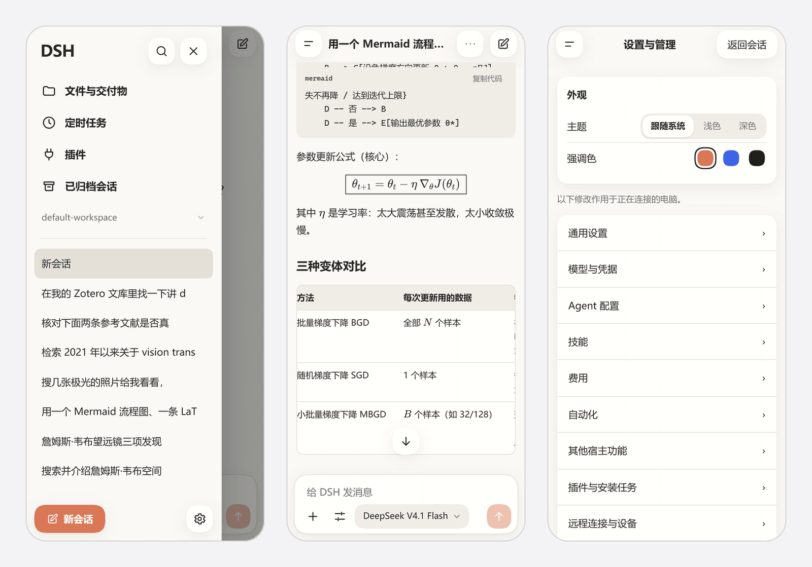
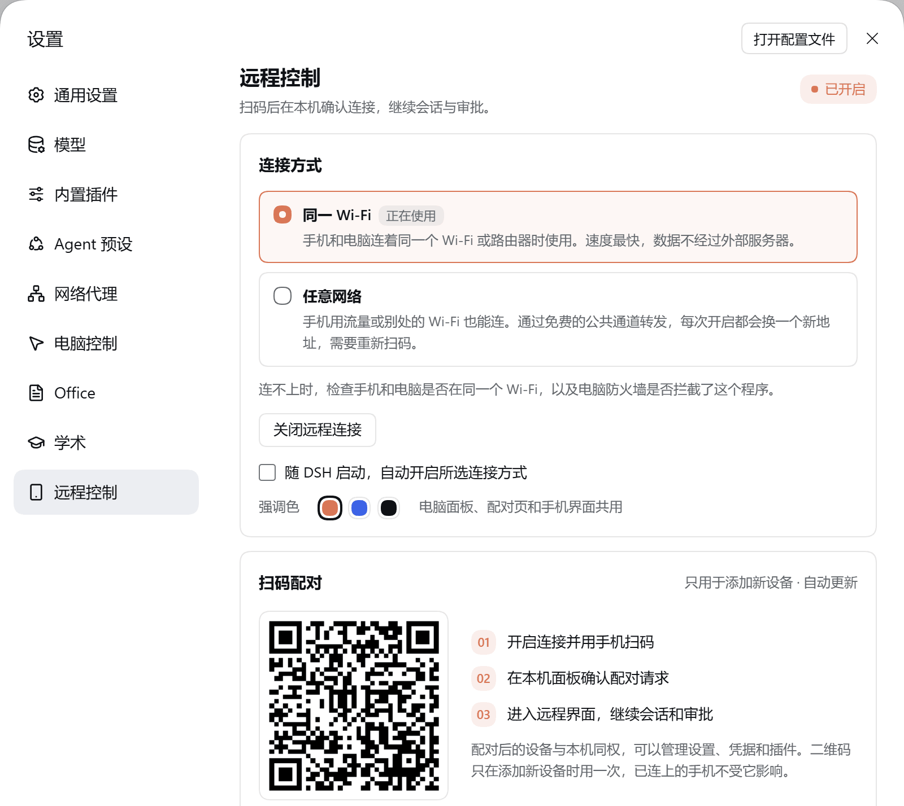
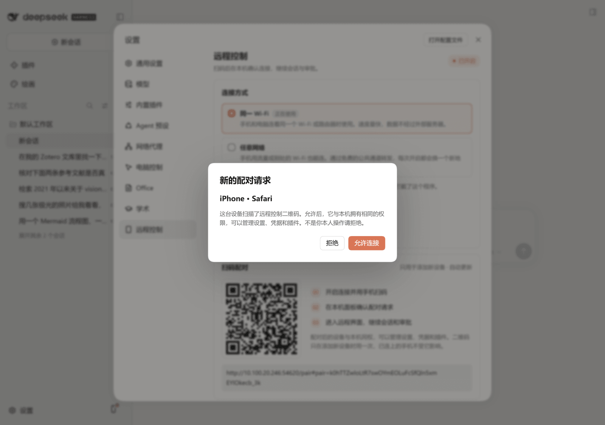

# dsh-remote-control

[](https://www.npmjs.com/package/@copylee/dsh-remote-control)

DeepSeek Harness（DSH）的远程控制插件：手机扫码、在电脑上确认后，用手机浏览器继续自己电脑上的会话、处理审批、查看文件和管理设置。电脑上的桌面应用和 `dsh web` 界面保持原样。



| 电脑端：选择连接方式并显示配对二维码 | 新设备扫码后，在电脑上确认 |
|---|---|
|  |  |

## 功能

| 功能 | 说明 |
| --- | --- |
| 两种连接方式 | “同一 Wi‑Fi”：手机与电脑在同一网络内直连。“任意网络”：经 Cloudflare Quick Tunnel 获得一个临时公网地址，不需要账号和域名 |
| 备用线路 | “任意网络”可改走 localhost.run（使用系统自带的 `ssh`，不下载任何组件）。实测速度很慢，只在 Cloudflare 开不起来时手动选用 |
| 扫码配对、本机确认 | 新设备扫码后进入等待页，电脑上弹出配对请求，允许后才能访问。新设备的首次批准只能在电脑上完成 |
| 设备管理 | 查看已授权设备（显示机型和连接方式）、重命名、撤销单台或全部设备 |
| 手机界面 | 独立的移动端界面：会话列表抽屉、底部输入区、分类设置页；提供浅色、深色、跟随系统三种主题 |
| 会话 | 新建、搜索、重命名、归档与恢复；选择工作区、模型、思考强度、Agent 和权限模式；Markdown、代码、表格、图片、附件、停止生成、工具审批、提问与方案确认 |
| 文件 | 浏览工作区，预览文本和图片，下载文件；在输入区上传附件 |
| 管理 | 宿主设置、凭据、插件安装与启停、定时任务、技能目录、工作区和远程设备 |
| 断线提示 | 手机与电脑失去联系时，界面顶部主动提示，恢复后自动重新读取状态；发送、审批、安装等写操作不会自动重放 |
| 强调色 | 陶土橙、蓝色、黑色三选一，电脑面板、配对页、手机界面以及 copylee 的其他插件共用同一个选择 |

## 安装

DSH 桌面版：**插件 → 添加插件**，输入 `@copylee/dsh-remote-control`，安装后启用。

命令行（`dsh web` 等其他 profile）：

```bash
dsh plugin --profile web add @copylee/dsh-remote-control@latest
```

桌面应用和 `dsh web` 使用各自的 profile，需要分别安装。

要求：DSH 0.2.0-rc.2 或更高，Node.js 22.19+ 或 24+。“任意网络”需要电脑能访问 Cloudflare；手机不需要代理。

## 使用

点击左侧栏底部的手机图标，或打开 **设置 → 远程控制**。

1. 选择“同一 Wi‑Fi”或“任意网络”，点击“开启远程连接”。“任意网络”首次开启会下载 Cloudflare 的连接组件，并在确认公网地址可用后才显示二维码。
2. 用手机扫描二维码，或打开复制的链接。
3. 电脑上弹出配对请求，确认设备名称后点“允许连接”。
4. 手机进入远程界面。

二维码只用于配对新设备，有效期 5 分钟，点击二维码可以刷新；已配对的手机不受二维码过期影响。

配对后是否需要重新扫码：

- “同一 Wi‑Fi”：授权保存在手机浏览器里，电脑重启连接后会尽量沿用上次的端口，手机打开原地址即可继续使用；连续 30 天不使用后授权过期。
- “任意网络”：每次开启都会换一个新地址，浏览器不会把旧地址的授权带到新地址，所以需要重新扫码并在电脑上确认。关闭连接时，这类设备记录会自动清除。

“关闭远程连接”会断开所有手机并保留“同一 Wi‑Fi”设备的授权；“撤销”立即断开对应设备并使其授权失效。已连接时改用另一种连接方式会先询问，确认后才断开当前连接。

### 连接不上时

- “任意网络”开不起来：先确认电脑能访问 Cloudflare。面板的“电脑访问外网的代理”默认不使用代理；直连不通时可改为“自动检测系统代理”或手动填写 HTTP(S) 代理地址（不接受带用户名密码的地址）。走代理反而连不上时改回“不使用”。仍不行可把线路换成 localhost.run。
- “同一 Wi‑Fi”打不开：确认手机与电脑在同一网络、路由器没有开启客户端隔离、手机没有开 VPN。Windows 防火墙可能拦截网关端口，需要在“Windows Defender 防火墙（高级安全）→ 入站规则”里手动允许面板显示的端口（TCP，建议限制为专用网络）。插件不会修改系统防火墙。

## 设置

| 选项 | 默认 | 说明 |
| --- | --- | --- |
| 连接方式 | 任意网络 | 同一 Wi‑Fi / 任意网络 |
| 随 DSH 启动 | 关 | 启动时自动开启所选连接方式，按 profile 保存 |
| 线路 | Cloudflare | Cloudflare / localhost.run（备用），只对“任意网络”有效 |
| 电脑访问外网的代理 | 不使用 | 不使用 / 自动检测系统代理 / 手动填写，只对“任意网络”有效 |
| 强调色 | 陶土橙 | 陶土橙 / 蓝色 / 黑色 |
| `gatewayPort`（插件配置项） | 自动 | 固定网关端口，便于维护防火墙规则 |

## 安全说明

- **已授权的设备与电脑本机权限相同**，可以管理设置、凭据和插件。只批准自己信任的设备。
- “任意网络”的 HTTPS 在 Cloudflare 边缘终止，本插件不提供端到端加密。“同一 Wi‑Fi”使用 HTTP，应只在可信网络中使用。
- 手机访问的是插件自己的认证网关，而不是 DSH 的端口。未配对的设备只能打开配对页，读不到任何宿主数据；网关在内部换用宿主凭据，原始凭据不会发给手机。
- 最多保存 32 台设备，超出时淘汰最久未使用且不在线的一台；同时最多等待 16 个配对请求。
- 关闭连接或撤销设备会立即中断对应的 HTTP、WebSocket 和 SSE 连接。

## 数据与隐私

- 授权与偏好保存在 `$DSH_HOME/dsh-remote-control/<profile>/`（未设置 `DSH_HOME` 时为 `~/.dsh`）。设备文件只保存随机密钥的 SHA-256 校验值、设备名称和时间，不保存密钥本身。
- “任意网络”的流量经过 Cloudflare（或 localhost.run）的服务器转发；“同一 Wi‑Fi”的流量不出局域网。
- 插件不收集、不上传使用数据。

## 工作原理

```
手机浏览器
   │  HTTPS（任意网络：Cloudflare Quick Tunnel / localhost.run）或 HTTP（同一 Wi‑Fi）
   ▼
认证网关（本插件，独立端口）  配对、设备 cookie、来源检查、限速
   │  回环地址，换用宿主凭据
   ▼
DSH Host 的 Web 服务  /api/remote.mux（WebSocket）、/plugins/*、文件接口
```

- 手机界面是随插件发布的独立前端：它启动宿主的客户端服务来读写会话和设置，界面本身由插件渲染。
- Cloudflare Quick Tunnel 不支持 SSE，远程引导脚本把宿主的 `/plugins/events` 事件流改由 WebSocket 传输，保留事件顺序、`Last-Event-ID` 和重连。
- 第三方插件的设置页通过兼容容器显示，依赖 DSH 0.2.0-rc.2 的内部渲染接口；宿主升级改变该接口时，对应页面会提示不可用，其余功能不受影响。

更多细节见 [功能对应清单](docs/features.md)、[验证记录](docs/verification.md)、[调研记录](docs/research.md) 和 [UI 规格](docs/ui-spec.md)。

## 开发

```bash
pnpm install
pnpm typecheck
pnpm test          # vitest：网关、配对、宿主集成
pnpm build
node scripts/check-package.mjs   # 检查打包内容
```

`pnpm qa:host` 在仓库的 `.qa/` 目录里启动一个隔离的 DSH Web profile，不触碰日常使用的 DSH 配置；`pnpm qa:browser` 用本机 Chrome 跑完整回归（配对、会话、文件、设置、撤销）。回归使用的测试模型只返回固定内容，不发出外部请求。

本地联调：DSH 桌面版“添加插件”里填本仓库目录路径（以 link 方式安装），`pnpm build` 后重启 DSH 生效。

## 致谢

实现时参考了 [dsh-remote-web-ui](https://github.com/zhu1090093659/dsh-web/tree/main/packages/dsh-remote-web-ui)、[DSH Remote](https://github.com/mrRisega/dsh-remote/tree/main/packages/dsh-remote-web) 和 [untun](https://github.com/unjs/untun)。本项目为独立实现，不使用这些项目作者的中继服务。

## 许可证

MIT
